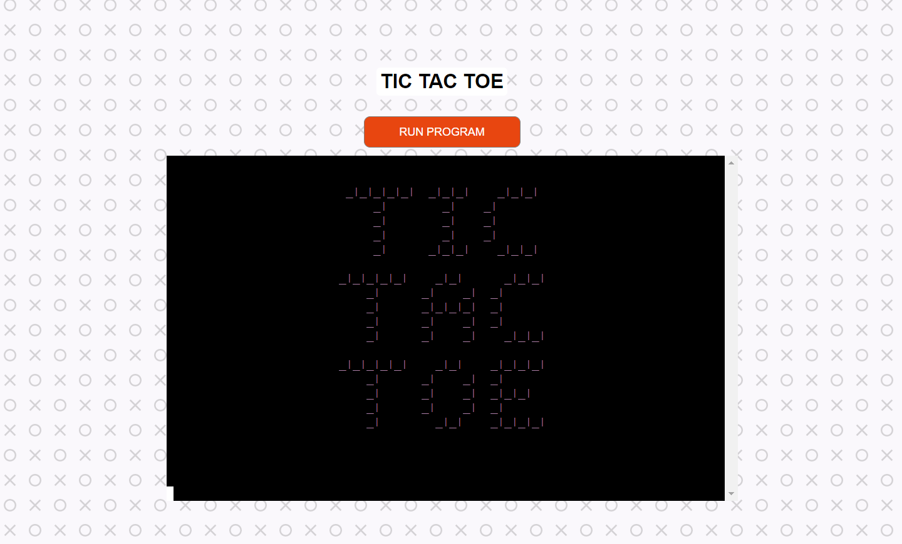
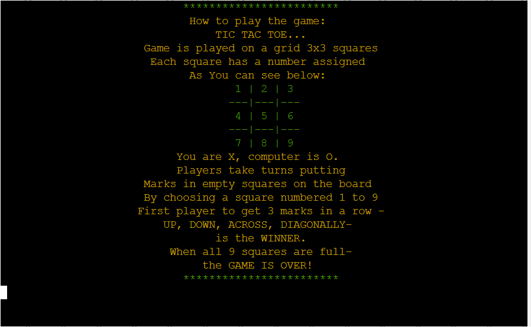
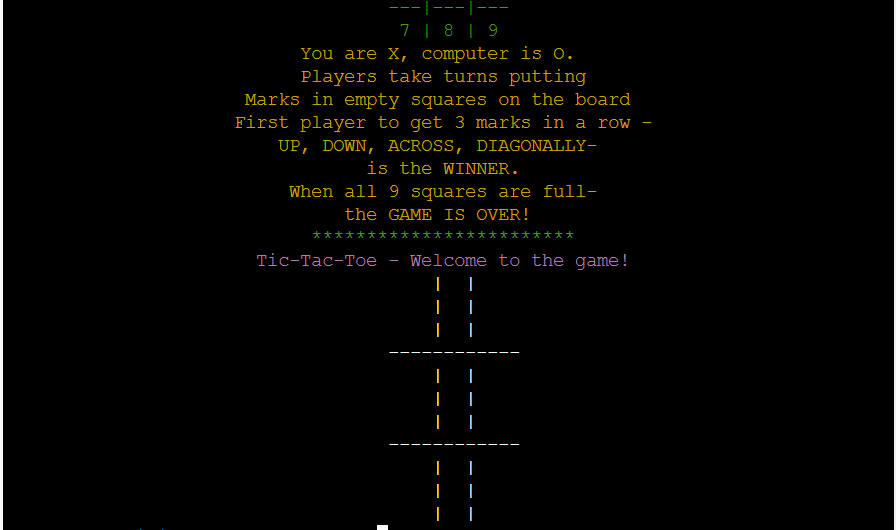
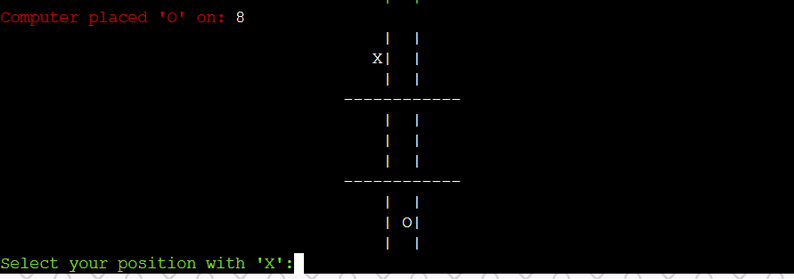
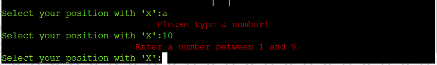
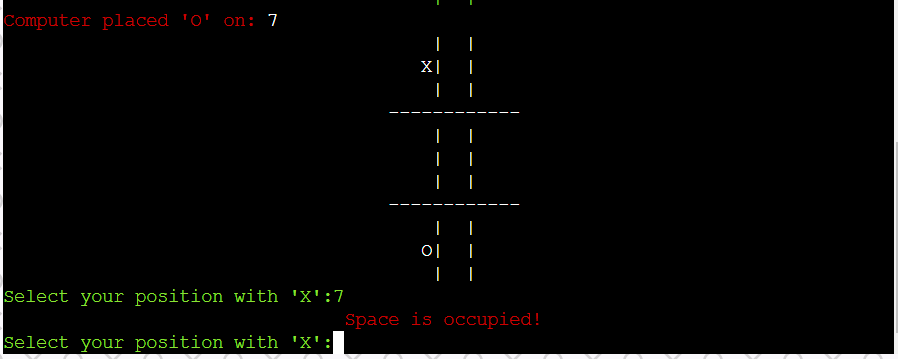

# TIC-TAC-TOE GAME
## [Link to the deployed application](https://jj-tic-tac-toe.herokuapp.com/)

## CONTENTS
---
* [USER EXPERIENCE](#user-exp)  

    * [User Stories](#user-stories)        

* [DESIGN](#design)  

    * [Colour Scheme](#colour-scheme)  
    * [Flow Chart](#flow-chart)  

* [FEATURES](#features)  

* [TECHNOLOGIES USED](#technologies-used)  

    * [Languages Used](#languages-used)
    * [Pyhon modules Used](#p-modules)
    * [Frameworks, Libraries and Programes Used](#frameworks-libraries-programs) 

* [TESTING]  

* [DEPLOYMENT AND LOCAL DEVELOPMENT](#deployment-development) 

    * [Deployment](#deployment)  

    * [Local Development](#local-development)  

        * [How To Fork](#how-to-fork)
        * [How To Clone](#how-to-clone)
        * [Using GitPod](#using-gitpod)

* [CREDITS](#Credits) 

    * [Code Used](#Code-Used)
    * [Acknowledgments](#Acknowledgments) 

## USER EXPERIENCE (UX) 
 ---
 ### User Stories 

 * As a First Time User I want to know what is the name of the game I am playing
 * As a First Time User I want to know if I am playing the game on my own or againt somebody ot a computer
 * As a First Time User I want to know how to play the game
 * As a First Time User I want to know when is my turn
 * As a First Time User I want to know who won
 * As a First Time User I want to know can I play again

 #### As a returning user I want to easily navigate through the game, even if I have not played it for a while 

---
 ## DESIGN 
 ---
 ### Colour Scheme 

 The colour scheme used was defined on COLORAMA python module

* __#FF80FF__ LIGHT MAGENTA was used to print a Tic Tac Toe logo, Welcome message and a Goodbye message
* __#FFFF00__ YELLOW was used to print instrucions and in a message about game ending in a tie as a neutral colour in the game
* __#00FF00__ GREEN was used to frame the instructions, light green version was used to print messages to the user like -
  place the letter and You have won. The resaon I have used the light green version is through testing I have found the contrast much more user friendly in pronted text
* __#FF0000__  RED colour I have used for printing out the computers moves, message that computer won the game and as warnings   about wrong input by the user
* __#FFFFFF__ WHITE is a default colour in the application and the game board is left as white  when it first prints in the game
---
## The Flow Chart 
---
### The flowchart was made using lucid chart
 ---
 ## THE FEATURES 
--- 
 * The Game has only one page where the computer runs the program.
    * Main Logo displayes at the beginning of the game
    
    *  Instructions on how to play the game are displayed next
    
    * Welcome to Tic-Tac-Toe displayes after a sleep function
     
    * Game board prints in the terminal
    
    * Messages display throught the game informing the user about computer moves and prompting the player to choose the move
    
    * In case of a wrong input a message is displayed prompting the player to choose the right move
    
    * In case the player want to put an X into an occupied place on the board
    
    * At the end of the game, when the user opts out from playing another round, a goodbye message is displayed
    
---
## TECHNOLOGIES USED 
---
### Languages Used 

* [CSS](https://developer.mozilla.org/en-US/docs/Web/CSSS) - was used to edit the layout (mainly add background) in the layout.html file
* [Python](https://www.python.org/) - was used to write the program.

### Python Modules Used  

* [random](https://docs.python.org/3/library/random.html) - was used to allow the computer to pick a random free space on the gameboard.
* [os](https://docs.python.org/3/library/os.html) - was used to write the function to clear the terminal.
* [time](https://docs.python.org/3/library/time.html) - was used to add a sleep function between displaying a message and clearing the terminal, or between 2 messages displaying.
* [colorama](https://pypi.org/project/colorama/) - was used to add colour schemes to content displaying in the terminal.

### Frameworks, Libraries and Programs Used  

* [Git](https://git-scm.com/) - for version control. 
* [GitHub](https://github.com/) - to store the project files.
* [GitPod](https://www.gitpod.io/) - as the CDE for development.
* [Heroku](heroku.com) - was used to deploy the progect.
* [Lucidchart](https://www.lucidchart.com/) - to create the flow chart.
* [Hero Patterns](https://heropatterns.com/) - to create a CSS background.

---
## TESTING
---
## DEPLOYMENT AND LOCAL DEVELOPMENT 
---
### Deployment 

Before deploying, make sure your requirements.txt is updated 

This project was deployed in Heroku and the steps to deploy are:

1. Create an account and login to Heroku.
1. On the dashboard, click the button NEW --> to create a new app on the right side of the webpage.
1. Choose a name for the app and choose your region. Click --> Create app.
1. Go to the Settings tab, Scroll down to the Config Vars. Add key PORT and value of 8000.
1. Scroll down to Buildpacks, add, in this order- buildpack python followed by buildpack nodejs.
1. Go to Deploy tab, Select GitHub as Deployment Method and connect your account.
1. Enter the name of your respository and connect.
1. Select the Branch and click- Connect Branch.

### Local Development 

#### How to Fork

1. Log in or Sign up to GitHUb
1. Go to this project repository: (https://github.com/jjanczynska/tic-tac-toe).
1. On the right hand side of the repository, there is a button with FORK on it --> click it.
1. A ne page "Create a ne Fork" will open, you can also edit the name if you would like.
1. At the bottom of the page - click on CREATE FORK.
1. Now, you have a copy of the project in your repositories.

#### How to Clone

1. Log in or Sign Up to GitHub
1. Go to this project repository: (https://github.com/jjanczynska/tic-tac-toe).
1. Click on the CODE button and select if you would like to clone with : HTTPS, SSH or GitHub CLI and copy the link.
1. Open the terminal in the code editor of your choice, and change the current working directory to the one you will use to clone the repository.
1. Type: "git clone" into the terminal and then paste the link you copied before, and press ENTER.

#### Using GitPod

If you would like to edit the copy of ths repository in GitPod, follow this steps:
1. Install the GitPod extension on your browser of choice.
1. On GitHub open the project repository you forked.
1. On the top of the page, on the right hand side, click the green button with GitPod, click it.
1. It opens the GitPod website. If you are a first time user - connect it to your GitHub account and authorize gitpod-io. In the next step - create your account.
1. GitPod will create your Workspacem which may take a while. After the workspace has been loaded, you can start editing in GitPod.
---
## CREDITS
---

### Code Used
* To come up with the design of the game and with how to approach it, I have found this [guide](https://inventwithpython.com/invent4thed/chapter10.html) very helpfull.
* To clear the screen- code found in [Geeks for Geeks](https://www.geeksforgeeks.org/clear-screen-python/)
and used it in my run.py:
~~~
_ = system("cls" if name == "nt" else "clear")
~~~
* To center an ASCII logo in the terminal Ih used the code form [StackOverflow](https://stackoverflow.com/questions/49745662/centering-ascii-graphics-python):
~~~
 padding = ' '*(width//2)
    parts = [padding[0: (width-len(p))//2+1]+p for p in logo]
    return '\n'.join(parts)
~~~
* to center text in the terminal I have learned in this [article](https://stackoverflow.com/questions/8907236/center-aligning-text-on-console-in-python).
---
### Acknowledgments

I would like to thank my Code Institute mentor, Spencer Barriball for his support and feedback. Also to my family and friends that have played a lot of Tic-Tac-Toe game in the last few weeks, to help me with testing.

