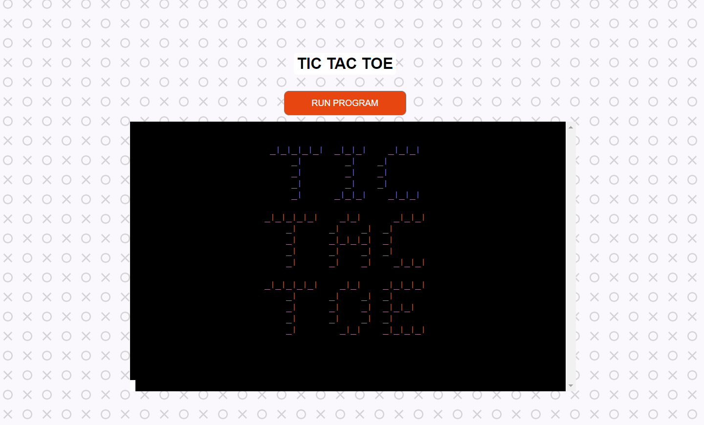

# TIC-TAC-TOE TESTING
---
### Deployed Site: [TIC-TAC-TOE](https://jj-tic-tac-toe.herokuapp.com/)

## CONTENTS
---
* [AUTOMATED TESTING](#automated-testing)

  * [Jigsaw Validator](#jigsaw-validator)
  * [CI Python Linter](#ci-python-linter)
  * [Lighthouse](#lighthouse)

* [MANUAL TESTING](#manual-testing)

  * [Testing User Stories](#testing-user-stories)
  * [Full Testing](#full-testing)

* [BUGS](#bugs)

  * [Known Bugs](#known-bugs)

Testing was conducted throught the project development cycle. Chrome dev tools was used for testing to display the result of the work. The link to the game was also shared with family and friends to conduct research on accesibillity, functionality and game features.

## AUTOMATED TESTING
---
### Jigsaw Validator
---
As I have added some CSS code to the layout.html file, I have used [Jigsaw Validator](https://jigsaw.w3.org/css-validator/
validator?uri=https%3A%2F%2Fjj-tic-tac-toe.herokuapp.com%2F&profile=css3svg&usermedium=all&warning=1&vextwarning=&lang=en) to check for errors. 

### CI Python Linter
---
No errors where found when testing in the [CI PYTHON LINTER](https://pep8ci.herokuapp.com/).
However - on the lines 68 - 93, warnings about trailing whitespaces showed. That is to do with logo in ASCII code being displayed. It has no bearing on game functionality.

### Lighthouse
---
I have used Chrome Dev Tools Lighthouse to test the performance, accsesibility and best practices.

Low score in SEO comes from the lack of meta description.

## Maual Testing
---
### Testing User Stories

| GOALS | HOW ARE THEY ACHIEVED |
| :--- | :--- | 
| As a First Time User I want to know what is the name of the game I am playing | The logo- TIC TAC TOE is the first thing displayed in the game console | 
| As a First Time User I want to know if I am playing the game on my own, againt somebody or a computer | Info about playing against the computer is displayed in the rules of the game | 
| As a First Time User I want to know how to play the game | The instructions of how to play the game are displayed after the logo | 
| As a First Time User I want to know when is my turn | prompt messages for the player are asking for their imput| 
| As a First Time User I want to know who won | Information a bout the result of the game is being displayed at the end of the game | 
| As a First Time User I want to know can I play again | The question to the player about game continuation is displayed after the results of the game| 

---
### Full Testing

| Feature | Expected Outcome | Testing Performed | Result | Pass/Fail |
| :--- | :--- | :--- | :--- | :--- |
| LOGO | LOGO Displaying at the start of the game| Run the game| LOGO is present| PASS |
| RULES OF THE GAME | Rules display in the terminal| Run the game | Rules are displaying | PASS |
| WELCOME MESSAGE | Displays after the rules with a 3 sec delay | Run the game | Message appears in the terminal after the rules after a 3 sec delay | PASS |
| GAME BOARD APPEARS IN THE TERMINAL | Game Board prints | Run the game | Game board is present | PASS |
| PROMPT TO THE PLAYER TO SELECT THEIR POSITION | Prompt in green prints in the terminal below the game board | Play the game | Prompt appears below the game board | PASS | 
| 'X' PLACED IN A POSITION CHOSEN BY THE PLAYER| X placed in the chosen square on the board | Play the game - choose the position | 'X' placed in the chosen square on the board | PASS | 
| INFORMATION ABOUT THE COMPUTER MOVE AND AN 'O' PRINTED ON THE BOARD | Message about the move taken by the computer and a board printed with the current move | Play the game, wait for the computer move | Message about the move taken by the computer and a board printed with the current move | PASS | 
| MESSAGE ABOUT WHO WON THE GAME | Information about who won displayed underneath a full game board | Complete the game, fill the board | Information about who won displayed underneath a full game board | PASS | 
| MESSAGE ABOUT A TIE | Information about a Tie result in the game underneath a full game board | Complete the game, fill the game board | Information about a Tie result in the game underneath a full game board | | 
| MESSAGE ABOUT A WRONG INPUT BY THE PLAYER WHILE CHOOSING THEIR MOVE  | Message in red - Enter a number between 1 and 9 | Input a number < 1 or > 9 | Message in red - Enter a number between 1 and 9 | PASS | 
| MESSAGE ABOUT AN INPUT THAT IS NOT A NUMBER | Message in red - Please type a number | In put a letter | Message in red - Please type a number | PASS |
| QUESTION TO THE PLAYER DO THEY WANT TO CONTINUE THE GAME? | Display message - Would you like to play again? (Y/N) | Finish the game | Displayed message - Would you like to play again? (Y/N) | PASS | 
| MESSAGE THANKING THE PLAYER FOR THE GAME | Message in magenta - Thank you for playing!| Choose option N in a question about another game | Message in magenta - Thank you for playing! | PASS |
| IF PLAYER CHOOSES TO PLAY AGAIN, THE GAME REPEATS FROM THE BEGINNING | Game logo displayes again | Choose option Y in a question about another game | Game logo displayes again | PASS |

---
## BUGS
---
### Known Bugs

## RETURN TO [README](README.md)